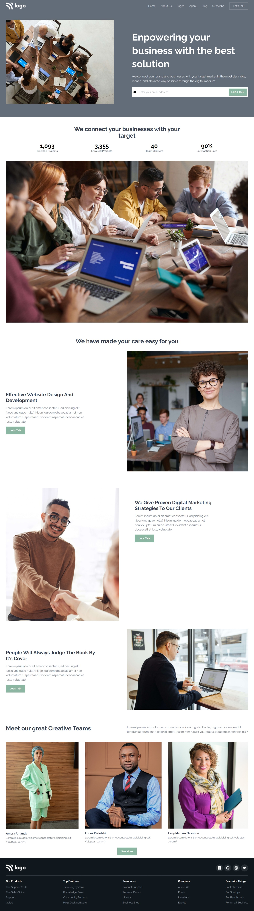

# Empower Business

> Project 12

<table>
<tr>
<td>
  A landing page designed using pure HTML & CSS.
</td>
</tr>
</table>

### Skills Gained from this

- Used TailwindCSS to build this.
- In the process learned about many tailwind utilities

### Screenshot

## Device support

The site is compatible with mobile, desktop/laptop screens.

## Author

